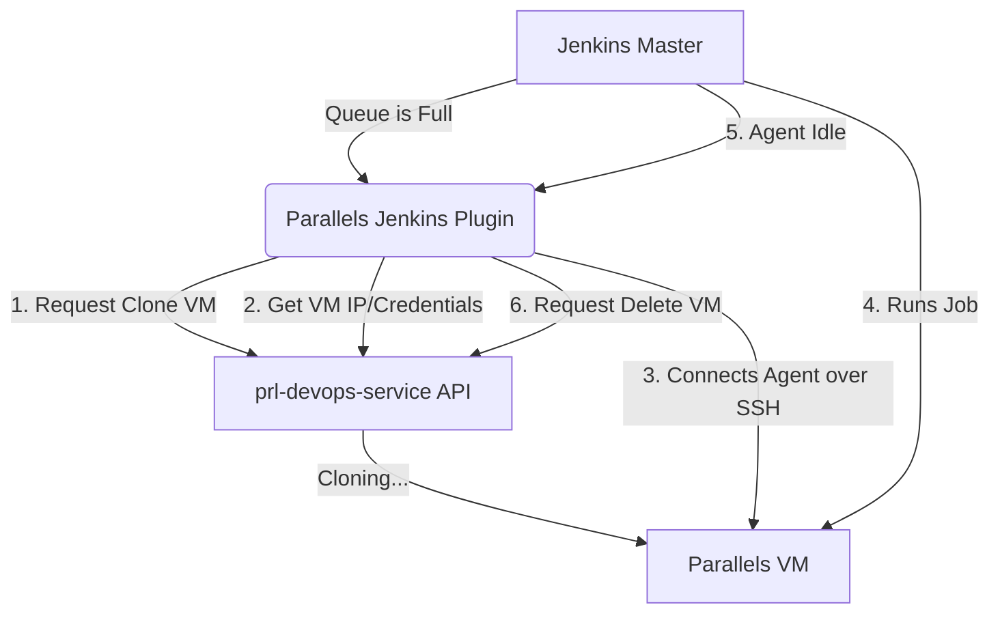

# Jenkins Cloud Plugin Analysis Report

## 1. Concept: What is a Jenkins Plugin and What Are We Achieving?

**Jenkins** is an automation server that executes CI/CD jobs using "Agents" (or nodes). Often, having a fixed number of agents is inefficient—you either pay for idle machines or don't have enough when developers need them.

**What are we trying to achieve?**
A **Jenkins Cloud Plugin**. Instead of a simple "build step", we will integrate `prl-devops-service` as a Cloud Provider in Jenkins. 

Just like how the GitHub Actions example clones a new Parallels VM dynamically to run a build and then deletes it, our Jenkins plugin will do exactly that natively. When Jenkins has jobs in the queue but no available agents, it will automatically ask our plugin to:
1. Ask `prl-devops-service` to clone a specific Virtual Machine (macOS/Windows/Linux).
2. Connect that VM to Jenkins as an agent (via SSH or JNLP).
3. Let Jenkins run the build on it.
4. Automatically destroy the VM via `prl-devops-service` when it's idle or the build is finished.

---

## 2. High-Level Design (HLD)

At a high level, the plugin acts as a dynamic node provisioner.

### Core Components
1. **Cloud Configuration**: Defines the global connection to the DevOps Service (URL, Credentials), and the **Connection Mode (Host API vs Orchestrator)**.
2. **Agent Template**: Defines the types of VMs available to clone (e.g., "macOS-Sonoma-Builder"). In Orchestrator mode, this leverages the **Catalog Service** to cache and rapidly deploy base images across a pool of hosts.
3. **Node Provisioner (Java)**: The engine that listens to the Jenkins queue and decides "I need to spawn 2 Jenkins agents of type macOS-Sonoma-Builder".
4. **Computer/Slave Implementation**: Represents the actual running VM inside Jenkins and manages its lifecycle (start, connect, terminate).

---

## 3. Low-Level Details

### Tech Stack
- **Language**: Java 11 or 17 (or Kotlin). *Note: Native Jenkins plugins cannot be written in Go. Because Jenkins is a Java application, plugins must run on the Java Virtual Machine (JVM) and implement Jenkins' core Java interfaces (like `hudson.slaves.Cloud`). However, the Java code will be kept very thin—its only job is to forward requests via HTTP to the `prl-devops-service`.*
- **Build System**: Maven (`maven-hpi-plugin`).
- **UI Views**: Jelly (`.jelly`) for the cloud/template configuration UI.

### Jenkins Extension Points to Implement
This architecture uses completely different Jenkins APIs than a standard build step:
1. `hudson.slaves.Cloud`: The main extension point. Represents the connection to `prl-devops-service`.
2. `hudson.slaves.NodeProvisioner.PlannedNode`: Represents a VM that is currently being cloned.
3. `hudson.model.Node` (specifically extending `AbstractCloudSlave`): Represents the VM once it's fully cloned and connected to Jenkins.
4. `hudson.slaves.ComputerLauncher`: The mechanism to install the Jenkins agent on the cloned VM (typically `SSHLauncher`).
5. `hudson.slaves.RetentionStrategy`: The logic that decides when to destroy the VM (e.g., "Destroy immediately after 1 build" or "Destroy after 5 minutes of idle time").

### API Communication (prl-devops-service)
- **Library**: `java.net.http.HttpClient` or `OkHttp`.
- **Endpoints Needed**:
  - `POST /api/v1/clone` (or equivalent) to clone the base VM.
  - `GET /api/v1/status` to poll until the VM is running and obtain its IP address.
  - `DELETE /api/v1/vm/{id}` to destroy the VM when no longer needed.
- **Authentication**: Using Jenkins Credentials plugin to store the token.

### Mapping Jenkins Cloud API to DevOps Endpoints

To understand *exactly* what Jenkins expects from us to build a Cloud Provider, we must implement 4 core Java classes from the Jenkins Core API. Here is how they map to your DevOps API endpoints:

1. **`hudson.slaves.Cloud` (The cloud provider configuration)**
   - **What Jenkins expects**: You must override the `provision(Label label, int excessWorkload)` method. Jenkins calls this method when the build queue is full.
   - **DevOps Mapping**: Inside this method, we will make a `POST` request to the DevOps API to **clone a new VM**. We then wrap the cloning process in a `PlannedNode` object and return it to Jenkins.

2. **`hudson.slaves.NodeProvisioner.PlannedNode` (The pending VM)**
   - **What Jenkins expects**: A Java `Future` object that Jenkins can monitor while the node is booting up.
   - **DevOps Mapping**: Inside this Future, we will repeatedly call the DevOps `GET` status endpoint until the VM is powered on and we have its IP address. Once ready, the Future completes and hands Jenkins an `AbstractCloudSlave`.

3. **`hudson.slaves.ComputerLauncher` (The connection mechanism)**
   - **What Jenkins expects**: Jenkins needs a way to install the `agent.jar` on the new VM.
   - **DevOps Mapping**: We don't necessarily need a custom API endpoint here. We will use Jenkins' built-in `SSHLauncher` to SSH into the VM IP address (acquired in step 2), download the agent, and start it automatically.

4. **`hudson.slaves.AbstractCloudSlave` (The running VM)**
   - **What Jenkins expects**: You must implement the `terminate()` method. Jenkins calls this method (via a `RetentionStrategy`) when the agent is idle or the job finishes.
   - **DevOps Mapping**: Inside `terminate()`, we will make a `DELETE` request to the DevOps API to **destroy the VM**, freeing up resources.

---

## 4. Must-Know Prerequisites for Development

Based on the official Jenkins tutorials, before starting any code, developers must understand and prepare the following:

1. **Java Development Kit (JDK)**: JDK 21 (or 11/17) is required since Jenkins is built on Java.
2. **Apache Maven**: The build tool needed to compile the Java code, manage dependencies, and package the plugin into an `.hpi` file using the `maven-hpi-plugin`.
3. **An IDE (IntelliJ IDEA, Eclipse, or NetBeans)**: The docs highly recommend IntelliJ IDEA with the "Jenkins Development Support" plugin to make developing Jenkins extensions much easier.
4. **Apache Commons Jelly**: Jenkins uses Jelly (`*.jelly` files) to define its HTML UI views (e.g., the global configuration page or job configuration UI). You need a basic understanding of Jelly tags (`<j:jelly>`, `<f:textbox>`).
5. **Jenkins Extensibility (Extension Points)**: Jenkins loads your logic by scanning for the `@Extension` Java annotation on classes that implement core interfaces.
6. **Jenkins Development Commands**: To quickly test the plugin during development, you will run the `mvn hpi:run` command, which spins up a temporary Jenkins server locally running your compiled plugin code.

---

## 5. Fragmented Deployment and Implementation Steps

To implement this plugin successfully, it should be broken down into the following exact steps (Git Issues):

1. **Task 1: Generate Plugin Skeleton**
   - Use the Jenkins Maven Archetype to configure the empty Java project shell.
2. **Task 2: Local Build & Run Automation**
    - Document clearly and automate the project steps for developers to compile, test, and run the plugin reliably in their local environment (`mvn hpi:run`).
3. **Task 3: Running on a Local Jenkins Server**
    - Ensure the plugin can be installed and run on a local Jenkins instance. Document the process of installing the `.hpi` file and configuring the Cloud provider in Jenkins.
4. **Task 4: Publishing to Jenkins Plugin Store**
    - Execute the open-source governance process to host the plugin on the `@jenkinsci` GitHub and publish the final `.hpi` release to the official Jenkins Update Center.
5. **Task 5: CI/CD Pipeline Automation (GitHub Actions)**
    - Create robust CI/CD workflows using GitHub Actions to automatically compile, test, and scan the plugin repository on every Pull Request.
6. **Task 6: API Client Implementation**
   - Create a pure Java client for the `prl-devops-service` to hit the clone, status check, and delete endpoints.
7. **Task 7: Implement `Cloud` Configuration**
   - Create the `PrlDevopsCloud` class extending `Cloud` to store credentials and the DevOps Service URL. Build the `.jelly` UI for the Jenkins System Configuration page.
8. **Task 8: Implement `CloudSlave` and `AgentTemplate`**
   - Define the VM configurations available to clone (e.g., Mac Builder). Define `PrlDevopsSlave` extending `AbstractCloudSlave` to represent the node in Jenkins.
9. **Task 9: Implement Node Provisioning Logic**
   - Implement the `provision()` method in the Cloud class. When Jenkins requests capacity, call the API to clone the VM, and return a `PlannedNode`.
10. **Task 10: Implement `ComputerLauncher` & Connection**
   - Wire up `SSHLauncher` to automatically SSH into the newly cloned VM IP and start the Jenkins agent programmatically.
11. **Task 11: Retention Strategy (Cleanup)**
   - Implement `CloudRetentionStrategy` to call the DevOps API tool to delete the VM when Jenkins marks it as idle or offline.
12. **Task 12: Testing & Packaging**
   - Use `JenkinsRule` to simulate node provisioning and ensure the cloud provider boots correctly. Package into `.hpi` and document.
13. **Task 13: User Documentation**
   - Write a detailed Markdown guide (similar to the `github-actions.md` example) explaining how Jenkins administrators install the `.hpi` file, select between Host/Orchestrator modes, and define their VM templates.
